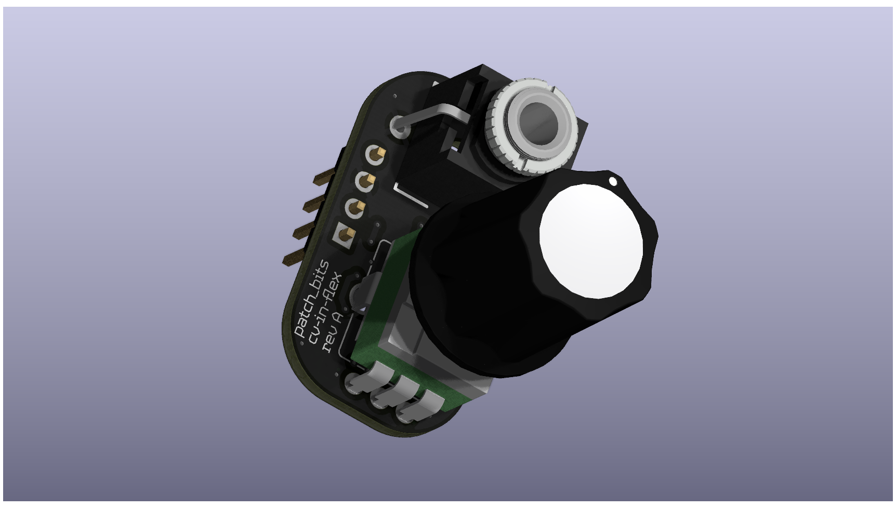
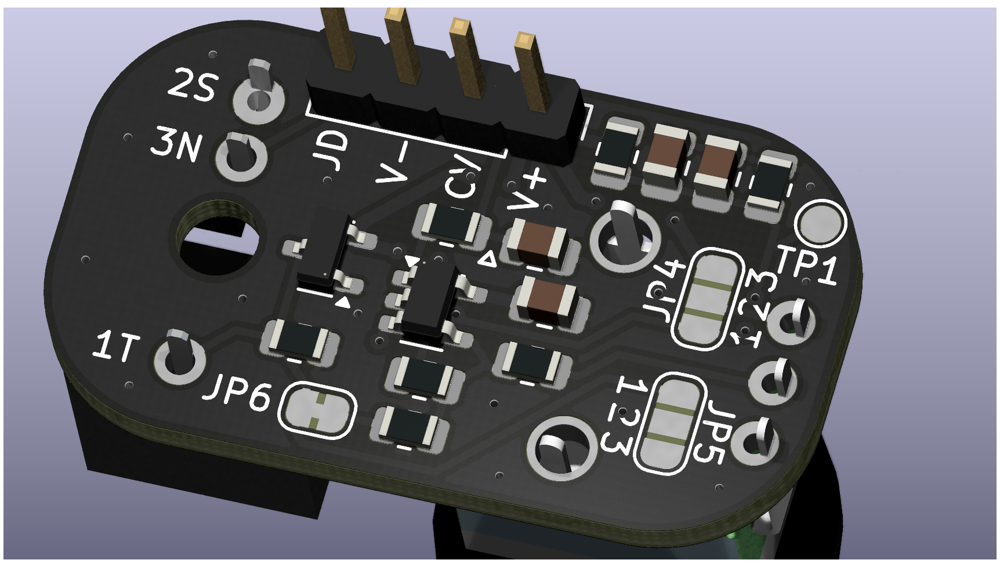

# Patch Bits: flex-cv-in

This board solves one big problem, and takes care of a handful of smaller ones along the way.

The big one is that RP2040 only gives you four ADC channels. That’s enough until you start designing synth modules and suddenly wish you had four CV inputs, each with a knob to offset or dial in a parameter manually. That’s the itch this board scratches.

flex-cv-in provides a footprint for a jack and a potentiometer. The knob and incoming CV are resistively summed into an inverting op-amp biased at mid-rail. The feedback resistor sets the gain to 2, restoring the original CV amplitude after averaging. The result is a stable, centered voltage where the knob sets a baseline and the CV input adds (or subtracts) modulation. That single output feeds one ADC channel.

Schottky diode clamps protect against over-voltage. There’s a dedicated jack detect pin designed for microcontrollers—pulled low when nothing’s inserted, floating high when a jack is present.

By default, the board runs in “bias” mode, which is ideal for parameters you want to sweep and modulate. But with two solder jumpers and a trace cut, you can reconfigure it into an attenuate mode. In that setup, the knob scales the incoming CV instead, centered around mid-rail. This is useful for things like linear FM, but the utility doesn’t stop there.

The board includes a low-pass RC filter on the output by default to tame ADC noise. If you want raw edges and wideband modulation, a labeled trace cut lets you disable that filter easily—no desoldering required.

It’s built for 3.3V or 5V single-supply systems, with short analog paths, proper biasing, and clean routing. It’s not calibrated, not meant for bipolar Eurorack signals, and not trying to be fancy. It just works—and it stays out of your way when you want to get creative.