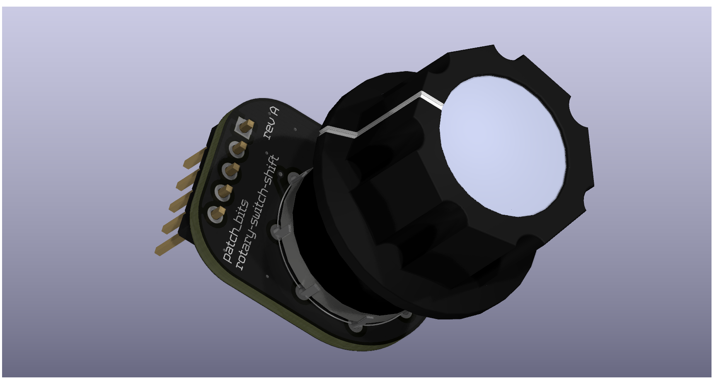
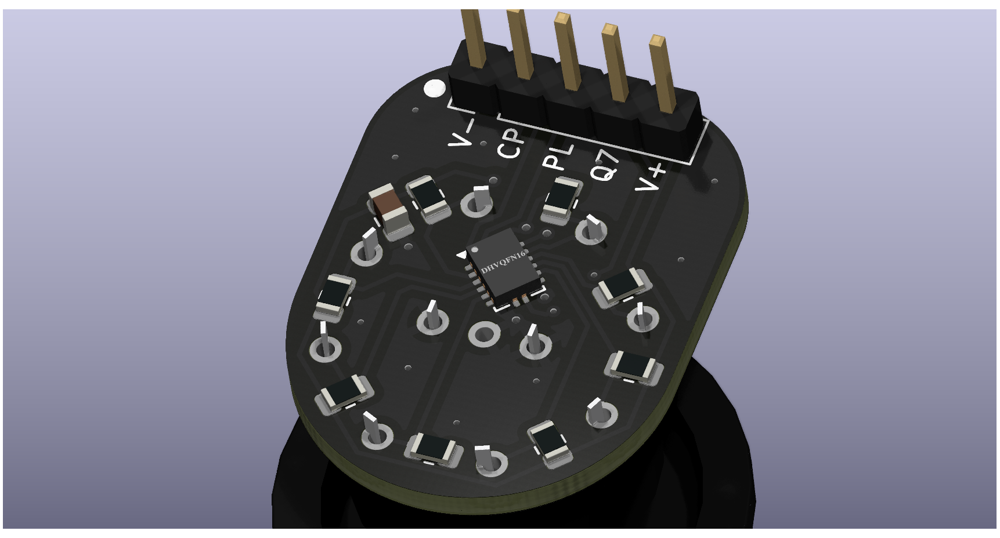
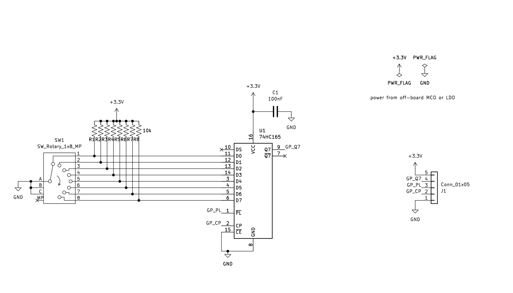

# Patch Bits: rotary-switch-shift

This one allows you to mount a rotary switch of single or dual poles, up to eight positions, and read the switch position from three GPIO pins via shift register.

10k pullup resistors keep the switch contacts high until they are pulled to ground by turning the knob. The shift register reads each contact in parallel and shifts the result out when commanded by your sketch.

When using a dual pole switch, since two simultaneous connections will be made, you must deal with the simultaneous low bits in software.

I'll post an example sketch once I can verify these work.